### Instalación de R

instalación general windows/mac/ubuntu

No requieres detalles si has llegado hasta este punto.

[Enlace R](https://cran.r-project.org/)

[Enlace RStudio](https://rstudio.com/products/rstudio/download/#download)

### Explorando datos simulados

- Distribucion Uniforme
- Distribucion No Uniforme
- Modelo lineal
- Modelo No lineal

Datos simulados

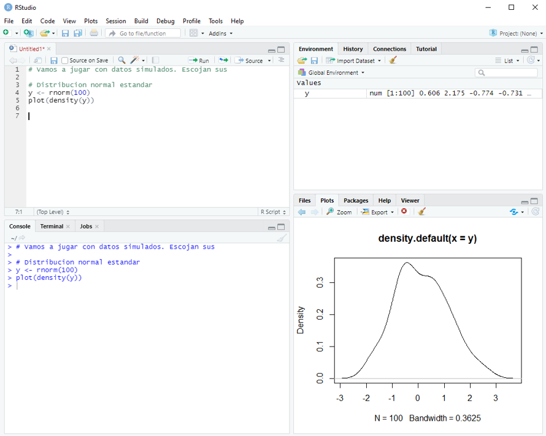

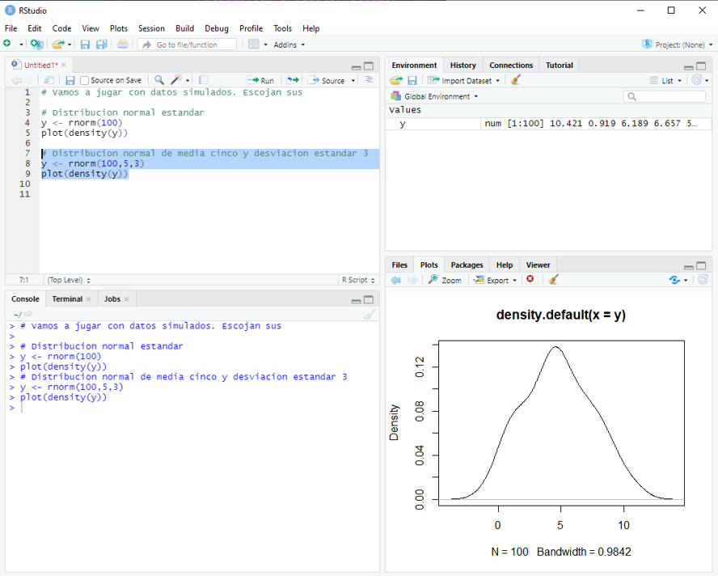

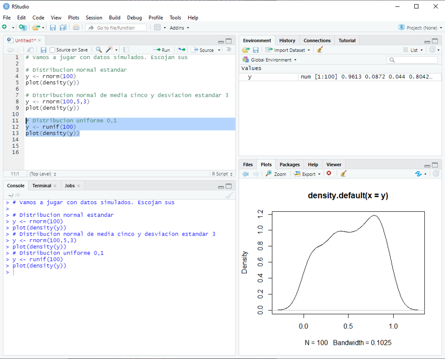

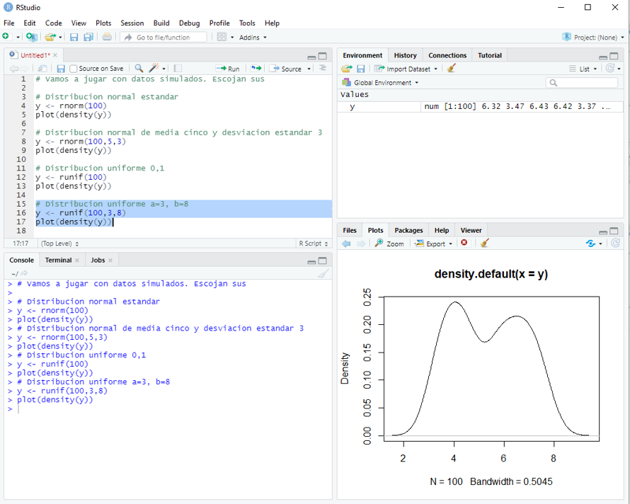

```R
# Vamos a jugar con datos simulados. Escojan sus

# Distribucion normal estándar
y <- rnorm(100)
plot(density(y))

# Distribucion normal de media cinco y desviación estándar 3
y <- rnorm(100,5,3)
plot(density(y))

# Distribucion uniforme 0,1
y <- runif(100)
plot(density(y))

# Distribucion uniforme a=3, b=8
y <- runif(100,3,8)
plot(density(y))
```

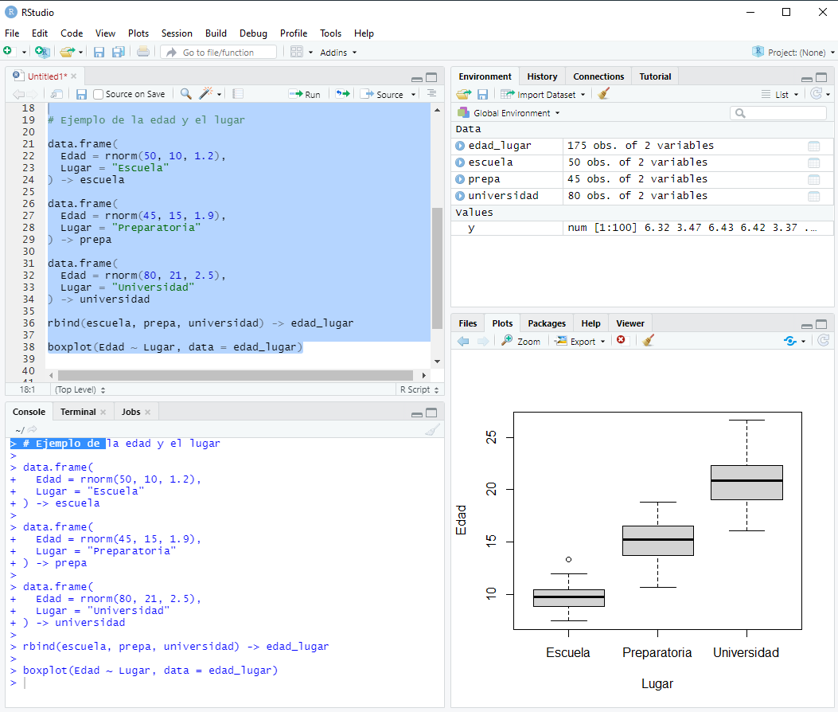

```R
# Ejemplo de la edad y el lugar

data.frame(
  Edad = rnorm(50, 10, 1.2),
  Lugar = "Escuela"
) -> escuela

data.frame(
  Edad = rnorm(45, 15, 1.9),
  Lugar = "Preparatoria"
) -> prepa

data.frame(
  Edad = rnorm(80, 21, 2.5),
  Lugar = "Universidad"
) -> universidad

rbind(escuela, prepa, universidad) -> edad_lugar

boxplot(Edad ~ Lugar, data = edad_lugar)
```

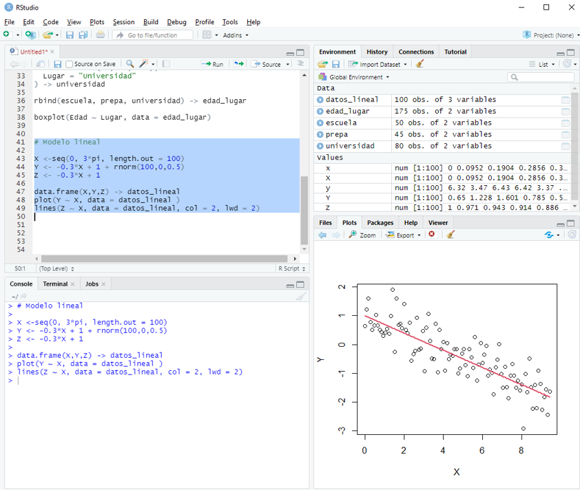

```R
# Modelo lineal

X <-seq(0, 3*pi, length.out = 100)
Y <- -0.3*X + 1 + rnorm(100,0,0.5)
Z <- -0.3*X + 1

data.frame(X,Y,Z) -> datos_lineal
plot(Y ~ X, data = datos_lineal )
lines(Z ~ X, data = datos_lineal, col = 2, lwd = 2)

```

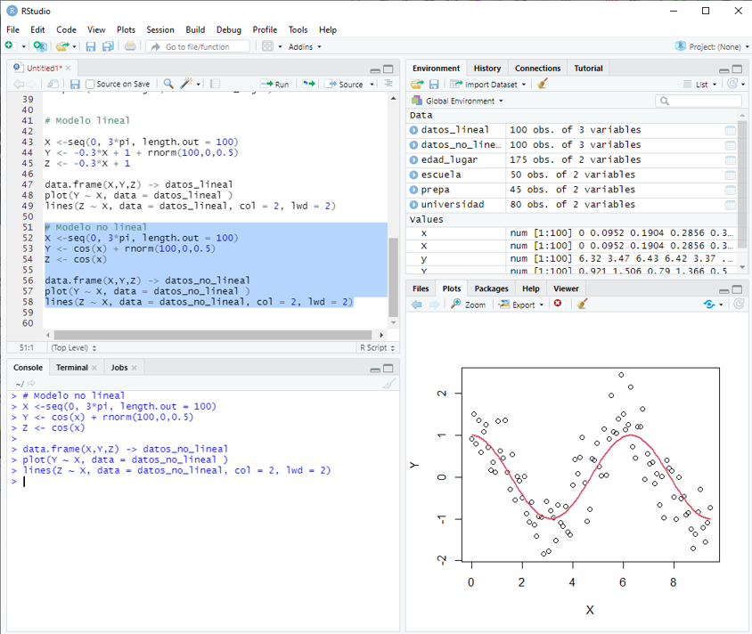

```R
# Modelo no lineal
X <-seq(0, 3*pi, length.out = 100)
Y <- cos(x) + rnorm(100,0,0.5)
Z <- cos(x)

data.frame(X,Y,Z) -> datos_no_lineal
plot(Y ~ X, data = datos_no_lineal )
lines(Z ~ X, data = datos_no_lineal, col = 2, lwd = 2)
```

### Simulando estimadores puntuales

En esta clase realizamos procesos de estimacion de parametros utilizando datos simulados.

La simulacion nos permite tener parametros conocidos, en la vida real nunca es posible conocer el parámetro.

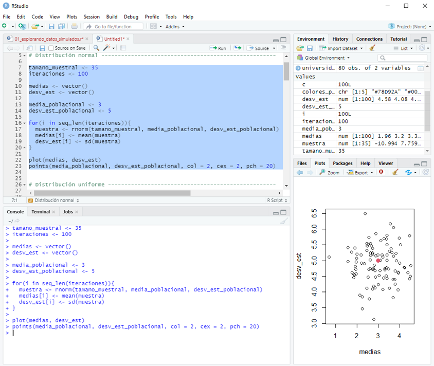

```r
tamano_muestral <- 35
iteraciones <- 100

medias <- vector()
desv_est <- vector()

media_poblacional <- 3
desv_est_poblacional <- 5

for(i in seq_len(iteraciones)){
  muestra <- rnorm(tamano_muestral, media_poblacional, desv_est_poblacional)
  medias[i] <- mean(muestra)
  desv_est[i] <- sd(muestra)
}

plot(medias, desv_est)
points(media_poblacional, desv_est_poblacional, col = 2, cex = 2, pch = 20)
```

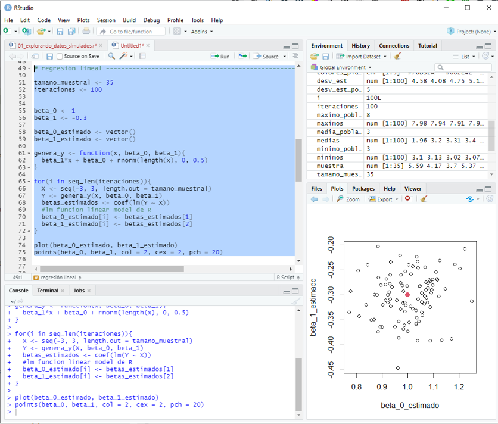

```r

tamano_muestral <- 35
iteraciones <- 100


beta_0 <- 1
beta_1 <- -0.3

beta_0_estimado <- vector()
beta_1_estimado <- vector()

genera_y <- function(x, beta_0, beta_1){
  beta_1*x + beta_0 + rnorm(length(x), 0, 0.5)
}

for(i in seq_len(iteraciones)){
  X <- seq(-3, 3, length.out = tamano_muestral)
  Y <- genera_y(X, beta_0, beta_1)
  betas_estimados <- coef(lm(Y ~ X))
  #lm funcion linear model de R
  beta_0_estimado[i] <- betas_estimados[1]
  beta_1_estimado[i] <- betas_estimados[2]
}

plot(beta_0_estimado, beta_1_estimado)
points(beta_0, beta_1, col = 2, cex = 2, pch = 20)
```

### Simulando intervalos de confianza

Ya simulamos procesos de estimacion puntual, ahora vamos a simular procesos de estimacion por intervalo.

Tendremos 2 poblaciones distribuidas normalmente con medias distintas, cada una de estas le pondremos un intervalo de confianza para que sean distintas realmente en la poblacion los intervalos no deberían traslaparse, lo comprobamos utilizando rectángulos y la recta x=y

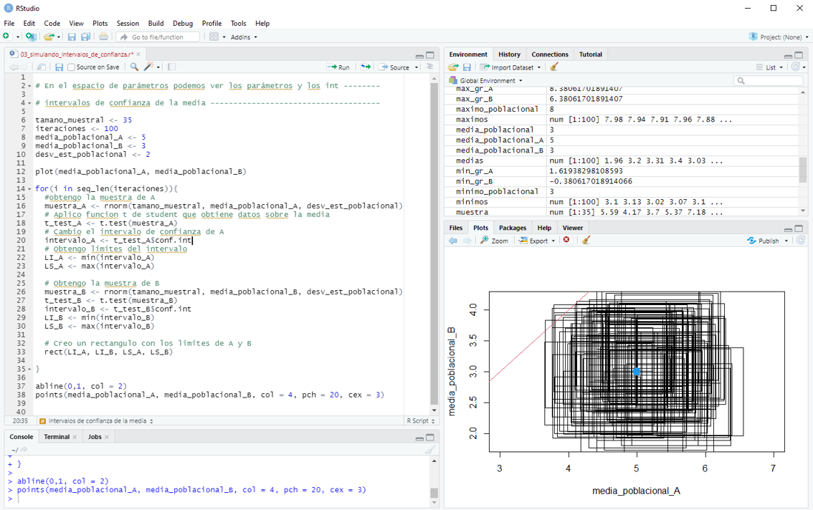

```R

# En el espacio de parámetros podemos ver los parámetros y los int --------

# intervalos de confianza de la media -------------------------------------

tamano_muestral <- 35
iteraciones <- 100
media_poblacional_A <- 5
media_poblacional_B <- 3
desv_est_poblacional <- 2

plot(media_poblacional_A, media_poblacional_B)

for(i in seq_len(iteraciones)){
  #obtengo la muestra de A
  muestra_A <- rnorm(tamano_muestral, media_poblacional_A, desv_est_poblacional)
  # Aplico funcion t de student que obtiene datos sobre la media
  t_test_A <- t.test(muestra_A)
  # Cambio el intervalo de confianza de A
  intervalo_A <- t_test_A$conf.int
  # Obtengo limites del intervalo
  LI_A <- min(intervalo_A)
  LS_A <- max(intervalo_A)

  # Obtengo la muestra de B
  muestra_B <- rnorm(tamano_muestral, media_poblacional_B, desv_est_poblacional)
  t_test_B <- t.test(muestra_B)
  intervalo_B <- t_test_B$conf.int
  LI_B <- min(intervalo_B)
  LS_B <- max(intervalo_B)

  # Creo un rectángulo con los limites de A y B
  rect(LI_A, LI_B, LS_A, LS_B)

}

abline(0,1, col = 2)
points(media_poblacional_A, media_poblacional_B, col = 4, pch = 20, cex = 3)
```

### Observando el comportamiento del tamaño muestral

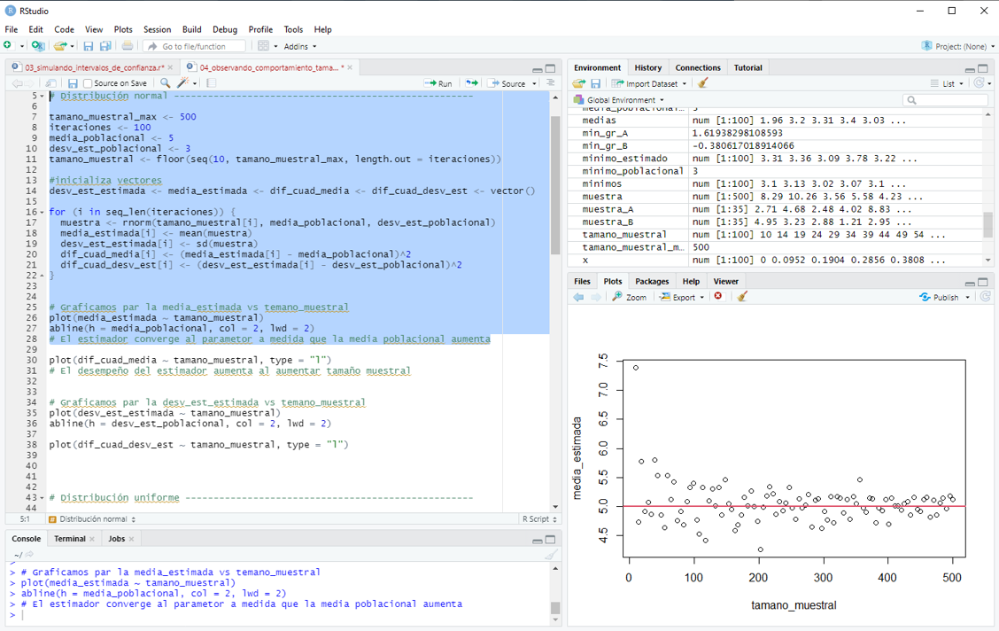

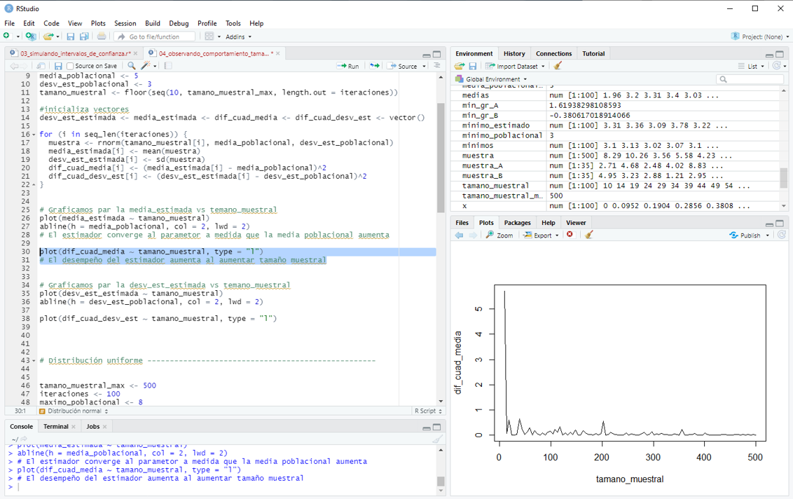

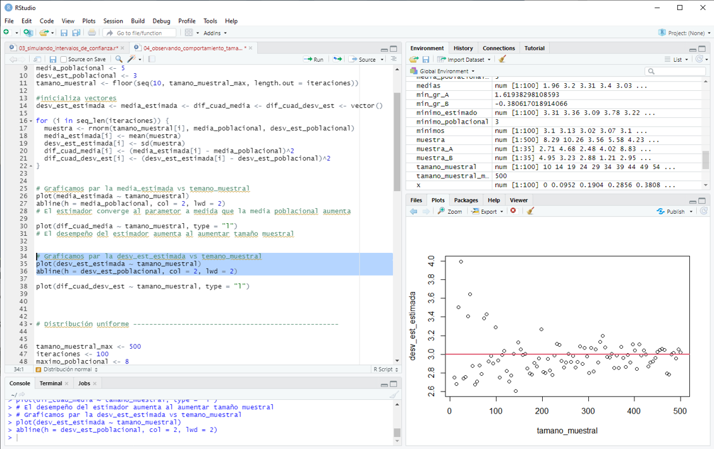

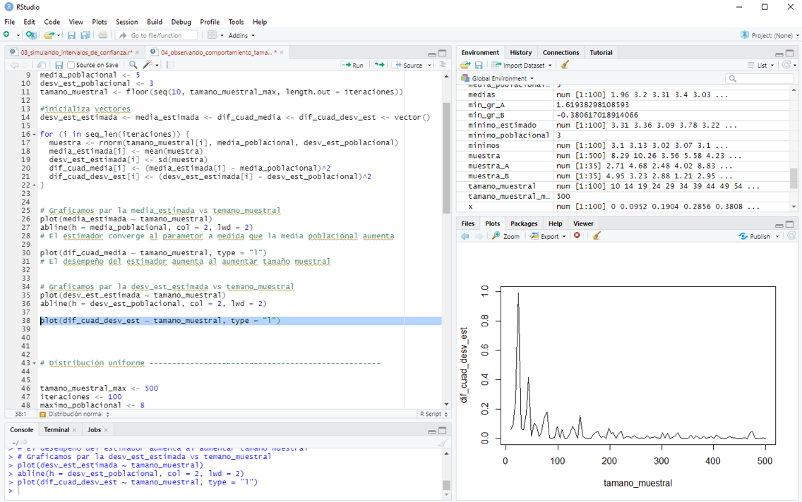

Observa cambiando los parametros del tamaño de muestra (usa 5000) y el numero de iteraciones.

Este es el comportamiento del tamaño muestral, se trata de la convergencia de los estimadores hacia los parametros, sin embargo podemos ver que esta convergencia no siempre es igual, al principio convergen muy fuerte pero luego se estabilizan un poco, lo que hace que haya **tamaños muestrales óptimos** para cada uno de los modelos que tenemos que estimar.

```r

# Podemos ver que el tamaño muestral presenta rendimientos decreci --------


# Distribución normal -----------------------------------------------------

tamano_muestral_max <- 500
iteraciones <- 100
media_poblacional <- 5
desv_est_poblacional <- 3
tamano_muestral <- floor(seq(10, tamano_muestral_max, length.out = iteraciones))

#inicializa vectores
desv_est_estimada <- media_estimada <- dif_cuad_media <- dif_cuad_desv_est <- vector()

for (i in seq_len(iteraciones)) {
  muestra <- rnorm(tamano_muestral[i], media_poblacional, desv_est_poblacional)
  media_estimada[i] <- mean(muestra)
  desv_est_estimada[i] <- sd(muestra)
  dif_cuad_media[i] <- (media_estimada[i] - media_poblacional)^2
  dif_cuad_desv_est[i] <- (desv_est_estimada[i] - desv_est_poblacional)^2
}


# Graficamos par la media_estimada vs tamano_muestral
plot(media_estimada ~ tamano_muestral)
abline(h = media_poblacional, col = 2, lwd = 2)
# El estimador converge al parámetro a medida que la media poblacional aumenta

plot(dif_cuad_media ~ tamano_muestral, type = "l")
# El desempeño del estimador aumenta al aumentar tamaño muestral


# Graficamos par la desv_est_estimada vs tamano_muestral
plot(desv_est_estimada ~ tamano_muestral)
abline(h = desv_est_poblacional, col = 2, lwd = 2)

plot(dif_cuad_desv_est ~ tamano_muestral, type = "l")


## Código adicional
# Distribución uniforme ---------------------------------------------------


tamano_muestral_max <- 500
iteraciones <- 100
maximo_poblacional <- 8
minimo_poblacional <- 3
tamano_muestral <- floor(seq(10, tamano_muestral_max, length.out = iteraciones))

maximo_estimado <- minimo_estimado <- dif_cuad_maximo <- dif_cuad_minimo <- vector()

for (i in seq_len(iteraciones)) {
  muestra <- runif(tamano_muestral[i], minimo_poblacional, maximo_poblacional)
  maximo_estimado[i] <- max(muestra)
  minimo_estimado[i] <- min(muestra)
  dif_cuad_maximo[i] <- (maximo_estimado[i] - maximo_poblacional)^2
  dif_cuad_minimo[i] <- (minimo_estimado[i] - minimo_poblacional)^2
}


plot(maximo_estimado ~ tamano_muestral)
abline(h = maximo_poblacional, col = 2, lwd = 2)

plot(dif_cuad_media ~ tamano_muestral, type = "l")


plot(minimo_estimado ~ tamano_muestral)
abline(h = minimo_poblacional, col = 2, lwd = 2)

plot(dif_cuad_desv_est ~ tamano_muestral, type = "l")


# Regresión lineal --------------------------------------------------------

tamano_muestral_max <- 500
iteraciones <- 100
beta_0 <- 1
beta_1 <- -0.3
minimo_poblacional <- 3
tamano_muestral <- floor(seq(10, tamano_muestral_max, length.out = iteraciones))

genera_x <- function(n) seq(-3, 3, length.out = n)

genera_y <- function(x, beta_0, beta_1){
  beta_1*x + beta_0 + rnorm(length(x), 0, 0.5)
}

beta_0_estimado <- beta_1_estimado <- dif_cuad_beta_0 <- dif_cuad_beta_1 <- vector()

for (i in seq_len(iteraciones)) {
  X <- genera_x(tamano_muestral[i])
  Y <- genera_y(X, beta_0, beta_1)
  betas <- coef(lm(Y ~ X))
  beta_0_estimado[i] <- betas[1]
  beta_1_estimado[i] <- betas[2]
  dif_cuad_beta_0[i] = (beta_0_estimado[i] - beta_0)^2
  dif_cuad_beta_1[i] = (beta_1_estimado[i] - beta_1)^2
}


plot(beta_0_estimado ~ tamano_muestral)
abline(h = beta_0, col = 2, lwd = 2)

plot(dif_cuad_beta_0 ~ tamano_muestral, type = "l")


plot(beta_1_estimado ~ tamano_muestral)
abline(h = beta_1, col = 2, lwd = 2)

plot(dif_cuad_beta_1 ~ tamano_muestral, type = "l")


```

### Estimando distribuciones simuladas

Los procesos de estimacion existen a nivel puntual y a nivel funcional, ya vimos como los estimadores a nivel puntual y a nivel de intervalo convergen a medida que la muestra aumenta, veamos que sucede con los estimadores de funciones.

Usaremos distribucion Kernel para estimar la distribuciones de unos datos uniformes

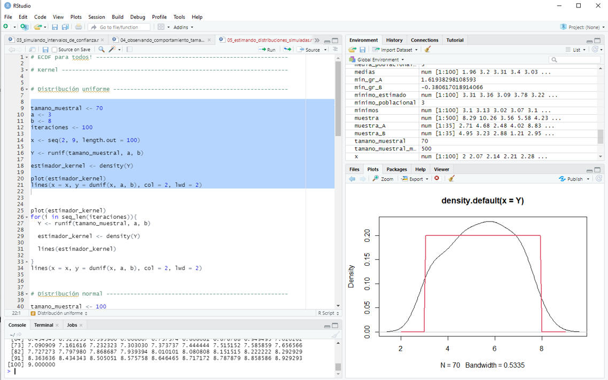

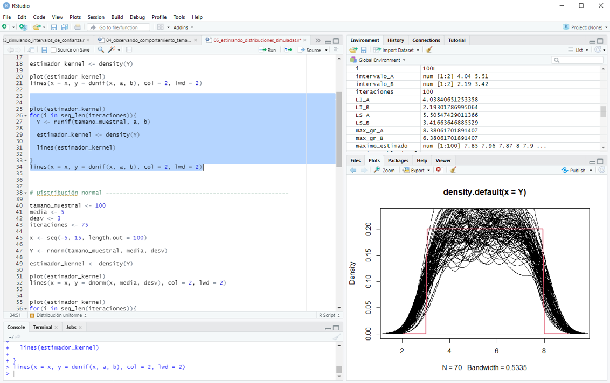

Aumentamos el numero de muestras a 7000

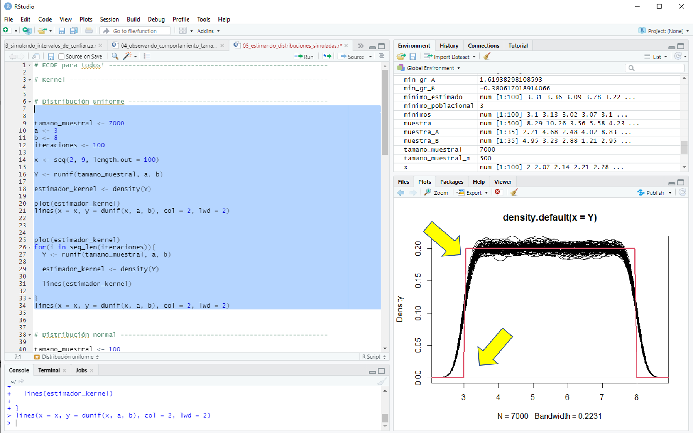

Observamos que a pesar del numero de muestras el estimador no se acerca al parámetro, por lo que este estimador es de tipo sesgado.

```R
# Distribución uniforme ---------------------------------------------------


tamano_muestral <- 7000
a <- 3
b <- 8
iteraciones <- 100

x <- seq(2, 9, length.out = 100)

Y <- runif(tamano_muestral, a, b)

estimador_kernel <- density(Y)

plot(estimador_kernel)
lines(x = x, y = dunif(x, a, b), col = 2, lwd = 2)


plot(estimador_kernel)
for(i in seq_len(iteraciones)){
  Y <- runif(tamano_muestral, a, b)

  estimador_kernel <- density(Y)

  lines(estimador_kernel)

}
lines(x = x, y = dunif(x, a, b), col = 2, lwd = 2)

```

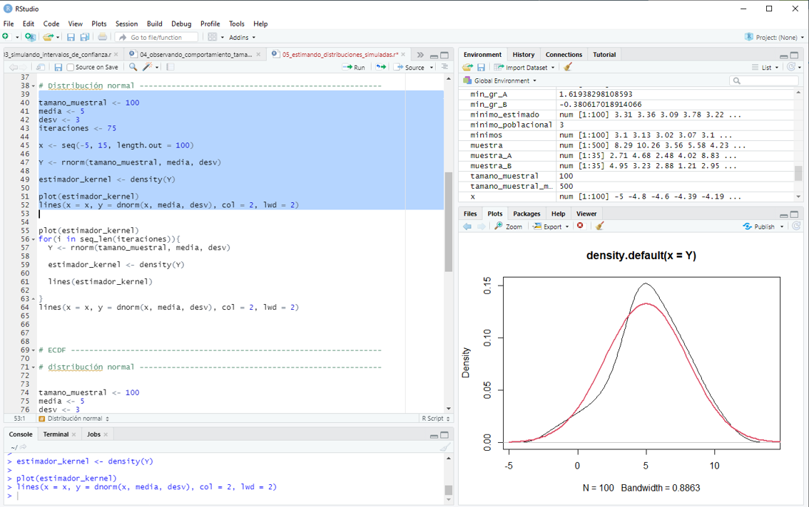

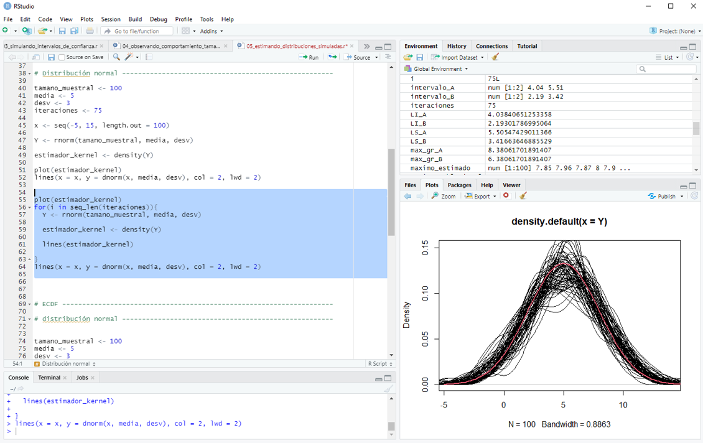

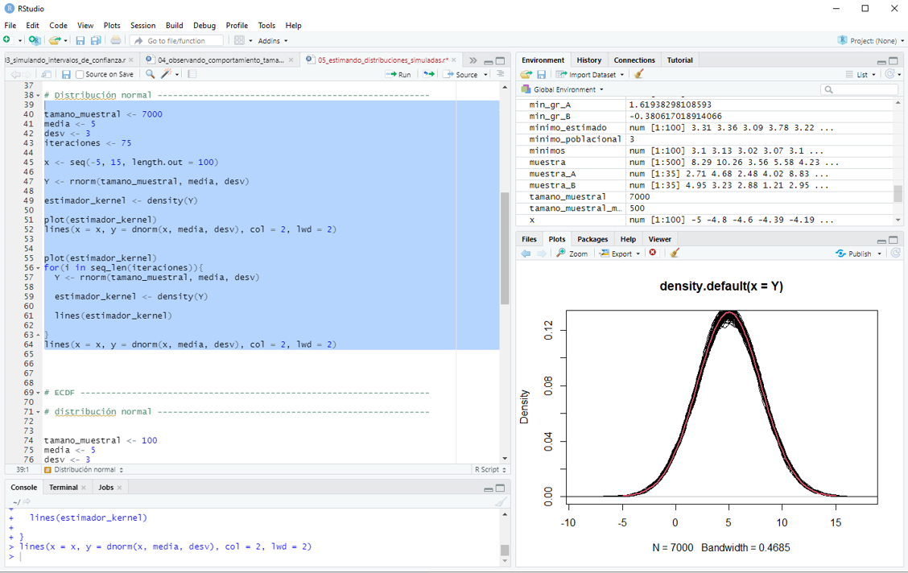

Observamos un fenómeno similar en la distribucion normal, aunque su estimador tiene mucho menos sesgo.

```r

tamano_muestral <- 7000
media <- 5
desv <- 3
iteraciones <- 75

x <- seq(-5, 15, length.out = 100)

Y <- rnorm(tamano_muestral, media, desv)

estimador_kernel <- density(Y)

plot(estimador_kernel)
lines(x = x, y = dnorm(x, media, desv), col = 2, lwd = 2)


plot(estimador_kernel)
for(i in seq_len(iteraciones)){
  Y <- rnorm(tamano_muestral, media, desv)

  estimador_kernel <- density(Y)

  lines(estimador_kernel)

}
lines(x = x, y = dnorm(x, media, desv), col = 2, lwd = 2)

```

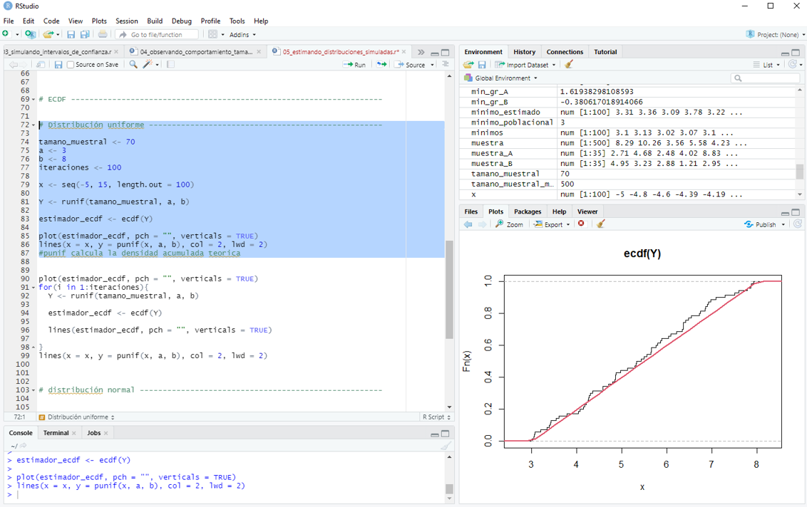

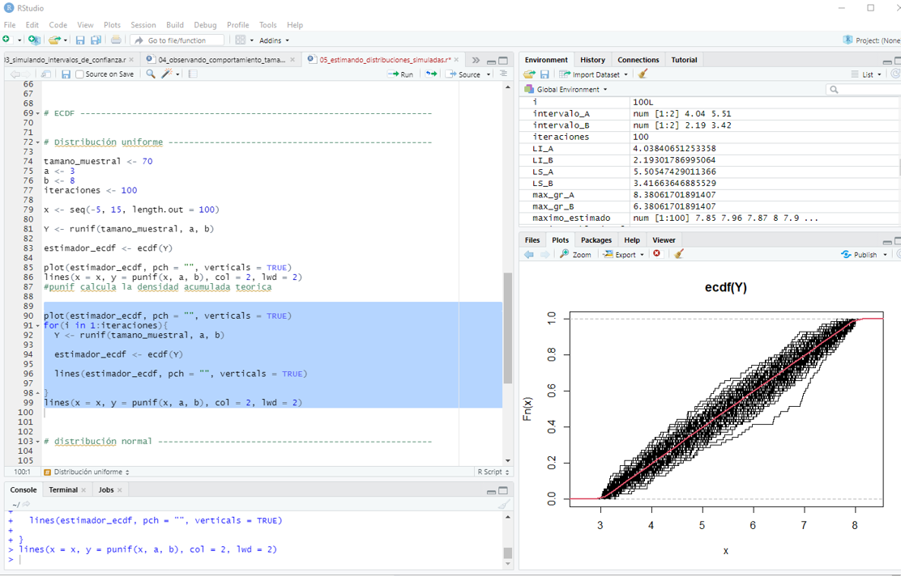

Este estimador no es sesgado, se encuentra dentro de la nube de puntos todo el tiempo, como observamos hay dos estimadores para densidad y para densidad acumulada empírica (kernel y ecdf)

```R

tamano_muestral <- 70
a <- 3
b <- 8
iteraciones <- 100

x <- seq(-5, 15, length.out = 100)

Y <- runif(tamano_muestral, a, b)

estimador_ecdf <- ecdf(Y)

plot(estimador_ecdf, pch = "", verticals = TRUE)
lines(x = x, y = punif(x, a, b), col = 2, lwd = 2)
#punif calcula la densidad acumulada teórica


plot(estimador_ecdf, pch = "", verticals = TRUE)
for(i in 1:iteraciones){
  Y <- runif(tamano_muestral, a, b)

  estimador_ecdf <- ecdf(Y)

  lines(estimador_ecdf, pch = "", verticals = TRUE)

}
lines(x = x, y = punif(x, a, b), col = 2, lwd = 2)
```

### Red neuronal vs. regresion lineal

Ya vimos como estimar funciones mediante Kernel y ecdf (funcion de densidad acumulada empírica), esto funciona unicamente a nivel univariado, pero a nivel multivariado podemos hacer la estimacion del valor esperado condicional.

Haremos la estimacion funcional del valor esperado condicional, para ello usaremos redes neuronales, una de las librerías para ello es **nnet**, aunque hay muchas otras como tensor flow y keras.

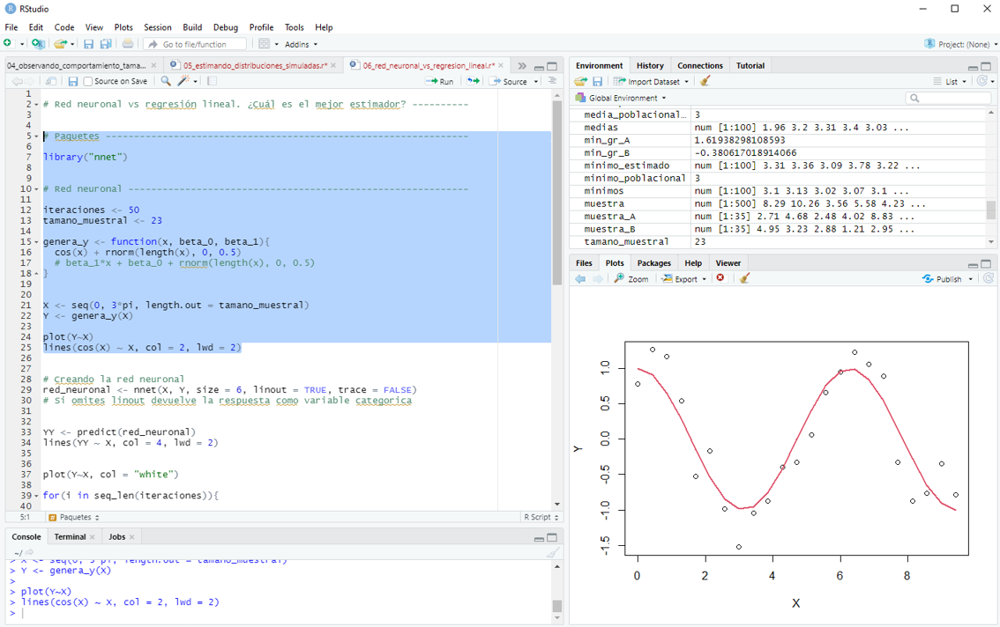

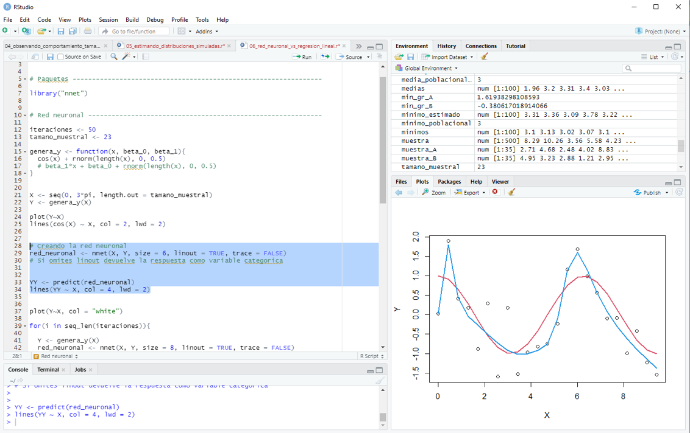

```r
# Red neuronal vs regresión lineal. ¿Cuál es el mejor estimador? ----------


# Paquetes ----------------------------------------------------------------

library("nnet")


# Red neuronal ------------------------------------------------------------

iteraciones <- 50
tamano_muestral <- 23

genera_y <- function(x, beta_0, beta_1){
  cos(x) + rnorm(length(x), 0, 0.5)
  # beta_1*x + beta_0 + rnorm(length(x), 0, 0.5)
}


X <- seq(0, 3*pi, length.out = tamano_muestral)
Y <- genera_y(X)

plot(Y~X)
lines(cos(X) ~ X, col = 2, lwd = 2)


# Creando la red neuronal
red_neuronal <- nnet(X, Y, size = 6, linout = TRUE, trace = FALSE)
# Si omites linout devuelve la respuesta como variable categórica


YY <- predict(red_neuronal)
lines(YY ~ X, col = 4, lwd = 2)


plot(Y~X)

for(i in seq_len(iteraciones)){

  Y <- genera_y(X)
  red_neuronal <- nnet(X, Y, size = 8, linout = TRUE, trace = FALSE)
  YY <- predict(red_neuronal)
  lines(YY ~ X, col = 4)

}

lines(cos(X) ~ X, col = 2, lwd = 2)

```

De este ejercicio podemos inferir que las redes neuronales no son un estimador sesgado, pues tiene al modelo dentro de la nube de estimadores.

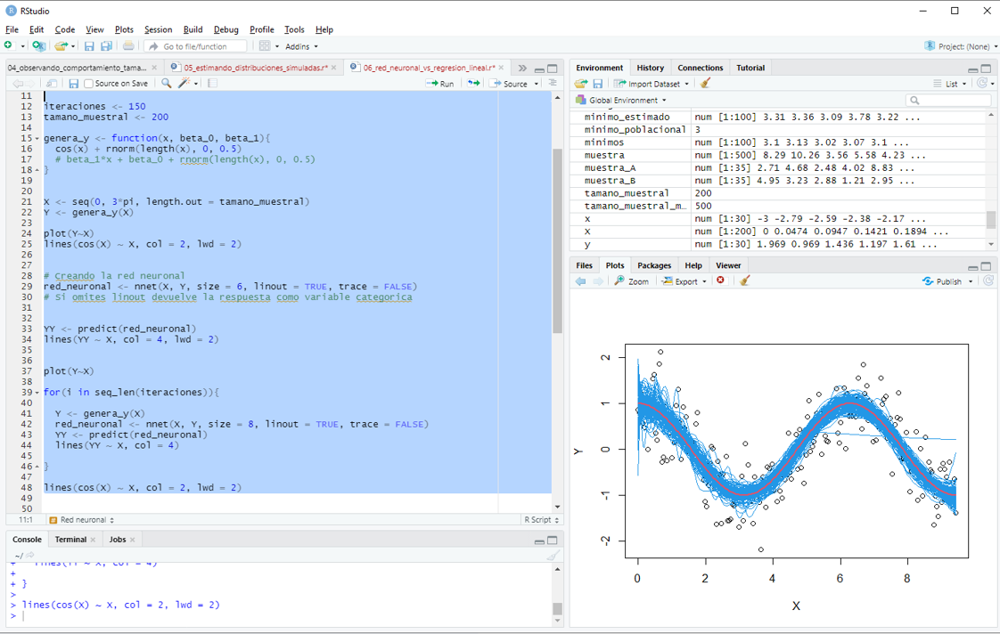

A medida que aumentamos el numero de iteraciones convergen los estimadores hacia el parámetro

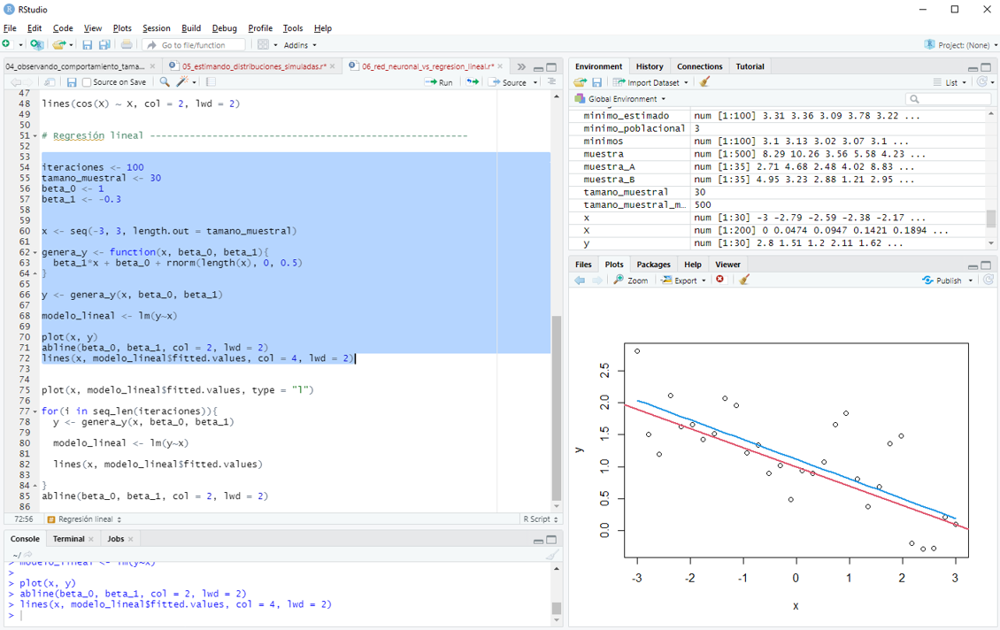

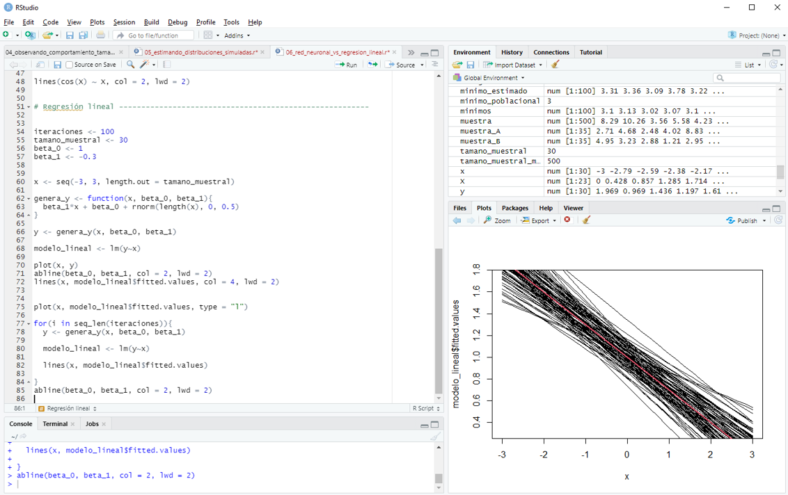

Comparativa utilizando solo la regresion lineal

[Modelos de Regresión con R
]
(<https://fhernanb.github.io/libro_regresion/>)
